# DJ Mixer — CSS → Tailwind CSS v4 Migration Plan

> **Goal**: Remove ALL `.css` files. Every style lives as Tailwind utility classes directly in JSX. Zero CSS files after migration. Fully responsive on phone / tablet / desktop.

---

## 📊 Current State Inventory

### CSS Files to Eliminate (12 files, ~71 KB total)

| # | File | Lines | Complexity | Component |
|---|------|-------|------------|-----------|
| 1 | `src/index.css` | 465 | 🟡 Medium | Global layout, app shell, floating actions, orientation warning |
| 2 | `src/styles/shared.css` | 55 | 🟢 Low | Modal base, overlay, header, close button |
| 3 | `src/components/Deck.css` | 651 | 🔴 High | Deck panel, header, vinyl row, controls, effects, loop, FX popup |
| 4 | `src/components/Mixer.css` | 582 | 🔴 High | Mixer panel, faders, VU meters, crossfader, EQ popup |
| 5 | `src/components/Waveform.css` | 197 | 🟡 Medium | Vinyl jog wheel, grooves, progress ring, label |
| 6 | `src/components/VerticalSlider.css` | 206 | 🟡 Medium | Pitch fader, touch-optimized thumb |
| 7 | `src/components/HorizontalSlider.css` | 81 | 🟢 Low | Crossfader track, thumb |
| 8 | `src/components/ScrollableWaveform.css` | 82 | 🟢 Low | Horizontal waveform bar, loading overlay |
| 9 | `src/components/TimeDisplay.css` | 66 | 🟢 Low | Time readout, compact mode |
| 10 | `src/components/SettingsModal.css` | 325 | 🟡 Medium | Settings modal, toggles, key bindings, layout selector |
| 11 | `src/components/AuthModal.css` | 114 | 🟢 Low | Login/register form |
| 12 | `src/components/UnifiedTrackSelector.css` | 316 | 🟡 Medium | Track library modal, tabs, search, track list, deck selector |
| 13 | `src/components/MixerEQ.css` | 38 | 🟢 Low | EQ slider overrides |

### TSX Files That Import CSS (12 imports to remove)

```
src/main.tsx          → imports index.css, shared.css
src/components/Deck.tsx           → Deck.css
src/components/Mixer.tsx          → Mixer.css
src/components/Waveform.tsx       → Waveform.css
src/components/VerticalSlider.tsx → VerticalSlider.css
src/components/HorizontalSlider.tsx → HorizontalSlider.css
src/components/ScrollableWaveform.tsx → ScrollableWaveform.css
src/components/TimeDisplay.tsx    → TimeDisplay.css
src/components/SettingsModal.tsx  → SettingsModal.css
src/components/AuthModal.tsx      → AuthModal.css
src/components/UnifiedTrackSelector.tsx → UnifiedTrackSelector.css
```

---

## 🎨 Design Token Mapping (CSS Variables → Tailwind)

Current CSS variables will be mapped to Tailwind's `theme.extend` config:

| CSS Variable | Tailwind Token | Value |
|---|---|---|
| `--color-bg-dark` | `colors.bg.dark` | `#1a1a1a` |
| `--color-bg-darker` | `colors.bg.darker` | `#121212` |
| `--color-bg-darkest` | `colors.bg.darkest` | `#0a0a0a` |
| `--color-bg-panel` | `colors.bg.panel` | `#1e1e1e` |
| `--color-bg-control` | `colors.bg.control` | `#252525` |
| `--deck-a-primary` | `colors.deck.a` | `#ff0080` |
| `--deck-b-primary` | `colors.deck.b` | `#00d4ff` |
| `--color-green` | `colors.accent.green` | `#00ff88` |
| `--color-yellow` | `colors.accent.yellow` | `#ffcc00` |
| `--color-red` | `colors.accent.red` | `#ff4444` |

> [!IMPORTANT]
> Some dynamic styles that use `var(--deck-color)` with `data-deck` attributes will need to stay as inline styles or use Tailwind's `data-*` variant modifiers.

---

## 📱 Responsive Breakpoint Strategy

### Tailwind Breakpoints to Use

| Breakpoint | Tailwind Class | Target |
|---|---|---|
| Default (mobile-first) | No prefix | Phone portrait |
| `sm:` | `≥640px` | Phone landscape |
| `md:` | `≥768px` | Tablet |
| `lg:` | `≥1024px` | Small desktop |
| `xl:` | `≥1200px` | Desktop |

### Custom Breakpoints Needed

```js
// tailwind.config — theme.extend.screens
screens: {
  'landscape': { raw: '(orientation: landscape) and (max-height: 500px)' },
  'landscape-sm': { raw: '(orientation: landscape) and (max-height: 400px)' },
  'portrait-mobile': { raw: '(orientation: portrait) and (max-width: 1024px)' },
}
```

### Small Screen Strategy — Controls in Modals

On **phone screens** (`< md` breakpoint):
- **Effects grid** → Hidden, replaced by **FX Toggle button** that opens a bottom-sheet modal
- **Cue points row** → Collapsed into the FX modal
- **EQ sliders** → Already in a popup (keep)
- **Pitch slider** → Stays visible (essential for mixing)
- **Play/Pause** → Stays visible (essential)
- **Waveform** → Reduced size vinyl or minimal bar

---

## 🔧 Phase 0 — Tailwind CSS v4 Setup

### Task 0.1: Install Tailwind CSS v4 + Vite Plugin

```bash
npm install tailwindcss @tailwindcss/vite
```

### Task 0.2: Configure Vite Plugin

Edit `vite.config.ts`:
```ts
import tailwindcss from '@tailwindcss/vite'

export default defineConfig({
  plugins: [
    tailwindcss(),
    react(),
    // ...existing plugins
  ],
})
```

### Task 0.3: Create Tailwind Entry CSS

Create a single `src/app.css` with the Tailwind import and theme configuration:

```css
@import "tailwindcss";

@theme {
  /* Core backgrounds */
  --color-bg-dark: #1a1a1a;
  --color-bg-darker: #121212;
  --color-bg-darkest: #0a0a0a;
  --color-bg-panel: #1e1e1e;
  --color-bg-control: #252525;
  --color-bg-header: #252525;
  --color-bg-control-dark: #333333;

  /* Deck colors */
  --color-deck-a: #ff0080;
  --color-deck-b: #00d4ff;

  /* Accent colors */
  --color-accent-green: #00ff88;
  --color-accent-yellow: #ffcc00;
  --color-accent-red: #ff4444;

  /* Text */
  --color-text-primary: #ffffff;
  --color-text-secondary: #aaaaaa;
  --color-text-muted: #666666;
  --color-text-hint: #888888;

  /* Borders */
  --color-border-subtle: rgba(255, 255, 255, 0.08);
  --color-border-medium: rgba(255, 255, 255, 0.15);
  --color-border-light: rgba(255, 255, 255, 0.1);

  /* Font */
  --font-main: 'Inter', -apple-system, BlinkMacSystemFont, 'Segoe UI', sans-serif;

  /* Radius */
  --radius-xs: 2px;
  --radius-sm: 4px;
  --radius-md: 6px;
  --radius-lg: 8px;
  --radius-xl: 12px;

  /* Custom breakpoints */
  --breakpoint-xs: 480px;
}

/* Base layer: reset + body styles */
@layer base {
  *, *::before, *::after {
    -webkit-tap-highlight-color: transparent;
  }

  html, body, #root {
    width: 100%;
    height: 100%;
    overflow: hidden;
    font-family: var(--font-main);
    background: var(--color-bg-darkest);
    color: var(--color-text-primary);
    -webkit-font-smoothing: antialiased;
    user-select: none;
    -webkit-user-select: none;
    overscroll-behavior: none;
  }

  body {
    cursor: default;
    position: fixed;
  }

  button {
    font-family: inherit;
    cursor: pointer;
    border: none;
    background: none;
  }

  :focus { outline: none; }
  :focus-visible {
    outline: 2px solid var(--color-deck-a);
    outline-offset: 2px;
  }

  img, a, button, [role="button"] {
    -webkit-user-drag: none;
    -webkit-touch-callout: none;
  }
}

/* Keyframes needed globally */
@keyframes rotate-phone {
  0%, 75%, 100% { transform: rotate(0deg); }
  25%, 50% { transform: rotate(90deg); }
}

@keyframes deck-spin {
  to { transform: rotate(360deg); }
}

@keyframes popup-fade-in {
  from { opacity: 0; transform: scale(0.95); }
  to { opacity: 1; transform: scale(1); }
}

@keyframes settings-pulse {
  0% { opacity: 1; }
  50% { opacity: 0.5; }
  100% { opacity: 1; }
}
```

### Task 0.4: Update `main.tsx`

Replace:
```tsx
import './index.css'
import './styles/shared.css'
```
With:
```tsx
import './app.css'
```

### Task 0.5: Remove StyleLint Config

Delete `.stylelintrc.json` (no longer needed).

---

## 🏗️ Phase 1 — Global Layout (App.tsx)

### Task 1.1: Migrate App Shell Layout

Convert `.app`, `.app-header`, `.app-main`, `.decks-section`, `.center-section` classes to Tailwind utilities directly in `App.tsx`.

**Key mappings:**
| CSS Class | Tailwind Classes |
|---|---|
| `.app` | `w-full h-dvh flex flex-col overflow-hidden relative pt-[env(safe-area-inset-top,5px)] pb-[env(safe-area-inset-bottom,5px)] pl-[env(safe-area-inset-left,5px)] pr-[env(safe-area-inset-right,5px)]` |
| `.app-header` | `flex items-center justify-between px-5 py-2.5 bg-black/80 backdrop-blur-lg border-b border-white/10 z-[1000] h-15` |
| `.app-main` | `flex-1 flex overflow-hidden` |
| `.decks-section` | `flex-1 flex min-h-0 w-full` |
| `.center-section` | `w-[16%] flex flex-col shrink-0 min-w-[100px]` |

### Task 1.2: Migrate Floating Actions

Convert `.floating-actions`, `.settings-floating-btn` with responsive variants.

### Task 1.3: Migrate Orientation Warning

Convert `.orientation-warning` to Tailwind with `portrait-mobile:` custom variant.

### Task 1.4: Remove `src/index.css`

Delete the file after all classes are migrated.

---

## 🎛️ Phase 2 — Simple Components (Low Complexity)

### Task 2.1: TimeDisplay.tsx

- Remove `import './TimeDisplay.css'`
- Convert 6 classes to inline Tailwind
- Handle compact mode with conditional classes
- Handle responsive with `landscape:` and `xl:` variants
- **Delete** `TimeDisplay.css`

### Task 2.2: HorizontalSlider.tsx

- Remove `import './HorizontalSlider.css'`
- Convert slider track, fill, thumb, center-line to Tailwind
- Use `cursor-grab active:cursor-grabbing`
- **Delete** `HorizontalSlider.css`

### Task 2.3: ScrollableWaveform.tsx

- Remove `import './ScrollableWaveform.css'`
- Convert waveform container, loading overlay
- Responsive: `md:h-[50px] landscape:h-10 max-md:h-12`
- **Delete** `ScrollableWaveform.css`

### Task 2.4: MixerEQ (Mixer.css subset)

- Convert EQ slider overrides to Tailwind
- **Delete** `MixerEQ.css`

### Task 2.5: Shared Styles

- Convert modal-base, modal-overlay-base, modal-header-base, icon-btn-close to reusable Tailwind class strings (constants or helper functions)
- **Delete** `src/styles/shared.css`

---

## 🎚️ Phase 3 — Medium Complexity Components

### Task 3.1: VerticalSlider.tsx

- Convert slider container, track, thumb, value display
- Handle touch-area widths with Tailwind arbitrary values
- Responsive: tablet / landscape / portrait breakpoints
- Pseudo-elements (`::before`, `::after` for thumb grooves) → Move to `@layer components` in `app.css` OR use `before:` / `after:` Tailwind variants
- **Delete** `VerticalSlider.css`

> [!WARNING]
> The thumb groove lines use `::before` and `::after` pseudo-elements. Tailwind v4 supports `before:` and `after:` variants, but complex positioning may need arbitrary values like `before:absolute before:top-1/2 before:left-2 before:right-2 before:h-px before:bg-black/15`.

### Task 3.2: Waveform.tsx (Vinyl Jog Wheel)

- Convert vinyl container, disc, position marker, label, reflection, progress ring
- Complex gradients → Use `bg-[radial-gradient(...)]` or inline styles
- The `::before` glow ring → `before:` variant
- SVG stroke styles → Keep as inline styles on SVG elements
- **Delete** `Waveform.css`

> [!NOTE]
> Some complex `radial-gradient` and `box-shadow` values can't be expressed cleanly as Tailwind utilities. Use arbitrary values: `bg-[radial-gradient(circle_at_center,#0a0a0a_0%,...)]` or keep as inline `style={}`.

### Task 3.3: AuthModal.tsx

- Convert modal, form, input, submit button, error display
- Responsive: mobile full-width
- **Delete** `AuthModal.css`

### Task 3.4: SettingsModal.tsx

- Convert modal, sections, toggles, key bindings list, layout selector
- Toggle switch `::after` pseudo-element → `after:` variant with `peer-checked:` or state classes
- 3 responsive breakpoints (mobile / landscape / very small)
- **Delete** `SettingsModal.css`

### Task 3.5: UnifiedTrackSelector.tsx

- Convert modal overlay, tabs, search input, track list, deck selector overlay
- Responsive: mobile full-screen modal
- **Delete** `UnifiedTrackSelector.css`

---

## 🔴 Phase 4 — High Complexity Components

### Task 4.1: Deck.tsx

**Sub-tasks:**

| Sub-task | Description |
|---|---|
| 4.1.1 | Deck container + header (label, track info, BPM) |
| 4.1.2 | Vinyl row layout (pitch control + center stage) |
| 4.1.3 | Transport controls (play/pause button) |
| 4.1.4 | Effects grid + cue buttons |
| 4.1.5 | Loop control (magic loop button) |
| 4.1.6 | Waveform placeholder / loading spinner |
| 4.1.7 | FX toggle button (mobile) |
| 4.1.8 | Effects popup (bottom sheet for mobile) |
| 4.1.9 | All 4 responsive breakpoints |

**Dynamic deck color challenge:**
The `data-deck="A"` / `data-deck="B"` pattern sets `--deck-color` used throughout. Solutions:
1. Pass color as prop and use conditional Tailwind: `deckId === 'A' ? 'border-deck-a shadow-deck-a/50' : 'border-deck-b shadow-deck-b/50'`
2. Create a helper: `const dc = (a: string, b: string) => deckId === 'A' ? a : b`

- **Delete** `Deck.css`

### Task 4.2: Mixer.tsx

**Sub-tasks:**

| Sub-task | Description |
|---|---|
| 4.2.1 | Mixer container + header row (VOL labels, settings gear) |
| 4.2.2 | Faders section layout |
| 4.2.3 | Volume slider containers |
| 4.2.4 | VU meter bars (LED segments with `.active`, `.high`, `.peak` states) |
| 4.2.5 | Mix center (label button, percentages) |
| 4.2.6 | Crossfader section |
| 4.2.7 | Advanced controls popup (EQ popup) |
| 4.2.8 | All 3 responsive breakpoints |

**VU Meter challenge:**
Each segment has dynamic `.active`, `.high`, `.peak` classes. Map to Tailwind conditional rendering:
```tsx
className={cn(
  'flex-1 min-h-1.5 rounded-sm border border-black/30 transition-all duration-75',
  isActive && level === 'normal' && 'bg-gradient-to-r from-green-600 via-accent-green to-green-600 shadow-[0_0_6px] shadow-accent-green border-transparent',
  isActive && level === 'high' && 'bg-gradient-to-r from-yellow-600 via-accent-yellow to-yellow-600 ...',
  isActive && level === 'peak' && 'bg-gradient-to-r from-red-600 via-accent-red to-red-600 ...',
)}
```

- **Delete** `Mixer.css`

---

## 🧹 Phase 5 — Cleanup & Verification

### Task 5.1: Remove All CSS Import Statements

Remove all `import './XXX.css'` lines from every TSX file.

### Task 5.2: Delete All CSS Files

```
DELETE:
  src/index.css
  src/styles/shared.css
  src/components/AuthModal.css
  src/components/Deck.css
  src/components/HorizontalSlider.css
  src/components/Mixer.css
  src/components/MixerEQ.css
  src/components/ScrollableWaveform.css
  src/components/SettingsModal.css
  src/components/TimeDisplay.css
  src/components/UnifiedTrackSelector.css
  src/components/VerticalSlider.css
  src/components/Waveform.css
```

### Task 5.3: Delete `src/styles/` Directory

Remove the entire directory.

### Task 5.4: Delete `.stylelintrc.json`

No longer needed.

### Task 5.5: Verify Zero CSS Files

```bash
find src -name "*.css" -type f
# Should return NOTHING
```

---

## ✅ Phase 6 — QA & Responsive Testing

### Task 6.1: Desktop Testing (≥1200px)

- [ ] Full 2-deck layout with center mixer visible
- [ ] All controls (effects, cues, loop, pitch) visible
- [ ] VU meters animate correctly
- [ ] Vinyl jog wheels render with glow effects
- [ ] Modals (settings, track selector, auth) render centered

### Task 6.2: Tablet Testing (768px–1200px)

- [ ] Layout compresses gracefully
- [ ] Reduced vinyl size
- [ ] FX toggle button appears
- [ ] Touch targets remain ≥44px

### Task 6.3: Phone Landscape (≤500px height, landscape)

- [ ] Two decks side by side, compressed
- [ ] Effects grid hidden → FX popup accessible
- [ ] Floating action buttons repositioned center-top
- [ ] Safe area padding for notch/dynamic island

### Task 6.4: Phone Portrait (≤767px)

- [ ] Orientation warning displayed
- [ ] Deck selector buttons large enough for touch

### Task 6.5: Cross-Browser

- [ ] Safari iOS (test touch, audio unlock, safe areas)
- [ ] Chrome Android
- [ ] Desktop Chrome / Firefox / Safari

---

## 📋 Execution Order (Recommended)

```mermaid
gantt
    title Migration Execution Order
    dateFormat X
    axisFormat %s

    section Phase 0
    Install Tailwind v4          :p0, 0, 1
    Configure Vite + app.css     :p0b, 1, 2

    section Phase 1
    App shell layout             :p1, 2, 4

    section Phase 2
    TimeDisplay                  :p2a, 4, 5
    HorizontalSlider             :p2b, 4, 5
    ScrollableWaveform           :p2c, 4, 5
    MixerEQ                      :p2d, 5, 6
    Shared styles                :p2e, 5, 6

    section Phase 3
    VerticalSlider               :p3a, 6, 7
    Waveform                     :p3b, 6, 8
    AuthModal                    :p3c, 7, 8
    SettingsModal                :p3d, 8, 9
    UnifiedTrackSelector         :p3e, 8, 10

    section Phase 4
    Deck.tsx                     :p4a, 10, 14
    Mixer.tsx                    :p4b, 10, 14

    section Phase 5-6
    Cleanup + Delete CSS         :p5, 14, 15
    QA Testing                   :p6, 15, 17
```



---

## ⚠️ Known Challenges & Decisions

### 1. Dynamic Deck Colors (`--deck-color`)
**Decision**: Use conditional Tailwind classes based on `deckId` prop instead of CSS custom properties. Create a helper utility:

```tsx
// utils/deckStyles.ts
export const deckColor = (deckId: 'A' | 'B') => ({
  primary: deckId === 'A' ? 'text-deck-a' : 'text-deck-b',
  border: deckId === 'A' ? 'border-deck-a' : 'border-deck-b',
  shadow: deckId === 'A' ? 'shadow-deck-a/50' : 'shadow-deck-b/50',
  bg: deckId === 'A' ? 'bg-deck-a' : 'bg-deck-b',
  glow: deckId === 'A' ? 'shadow-[0_0_12px_#ff0080]' : 'shadow-[0_0_12px_#00d4ff]',
});
```

### 2. Complex Gradients & Box Shadows
**Decision**: Use Tailwind arbitrary values for simple cases, fall back to inline `style={{}}` for complex multi-stop gradients (vinyl disc, VU meters).

### 3. Pseudo-Elements (`::before`, `::after`)
**Decision**: Use Tailwind's `before:` and `after:` variants where possible. For complex cases (slider thumb grooves), keep minimal CSS in `@layer components` inside `app.css`.

### 4. Keyframe Animations
**Decision**: Define in `app.css` `@keyframes` blocks and reference via `animate-[name]` arbitrary values, or add to theme config.

### 5. `env(safe-area-inset-*)` Values
**Decision**: Use Tailwind arbitrary values: `pt-[env(safe-area-inset-top,5px)]`

### 6. Class Name Length
**Decision**: For very long class strings, extract into local variables at the top of render functions or use a `cn()` / `clsx()` helper for conditionals. Consider installing `clsx`:
```bash
npm install clsx
```

---

## 📁 Final File Structure (Post-Migration)

```
src/
├── app.css                    ← ONLY CSS file (Tailwind imports + base + keyframes)
├── main.tsx                   ← import './app.css'
├── App.tsx                    ← Tailwind classes inline
├── utils/
│   └── deckStyles.ts          ← NEW: deck color helper
├── components/
│   ├── Deck.tsx               ← Tailwind classes inline (NO .css)
│   ├── Mixer.tsx              ← Tailwind classes inline (NO .css)
│   ├── Waveform.tsx           ← Tailwind classes inline (NO .css)
│   ├── VerticalSlider.tsx     ← Tailwind classes inline (NO .css)
│   ├── HorizontalSlider.tsx   ← Tailwind classes inline (NO .css)
│   ├── ScrollableWaveform.tsx ← Tailwind classes inline (NO .css)
│   ├── TimeDisplay.tsx        ← Tailwind classes inline (NO .css)
│   ├── SettingsModal.tsx      ← Tailwind classes inline (NO .css)
│   ├── AuthModal.tsx          ← Tailwind classes inline (NO .css)
│   ├── UnifiedTrackSelector.tsx ← Tailwind classes inline (NO .css)
│   ├── WaveformBar.tsx        ← (no CSS currently)
│   └── InstallPWA.tsx         ← (no CSS currently)
├── styles/                    ← DELETED
│   └── (empty — directory removed)
```
